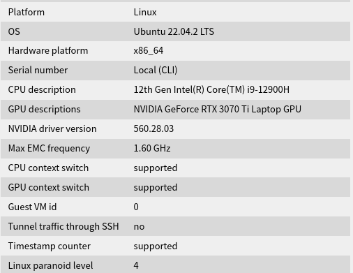

平台：



考虑到input只是只读部分，我们可以考虑将其加入只读缓存中．

V2: 精简排序算法，提高算法效率
```c
tmp[threadIdx.x] = max(input[row * N + threadIdx.x], input[row * N + threadIdx.x + COLS / 2]);
```


当 N = 32 时，一个warp正好可以处理一行矩阵数据．此时采取warp归约可以取得更好的优化效果．